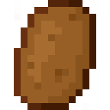
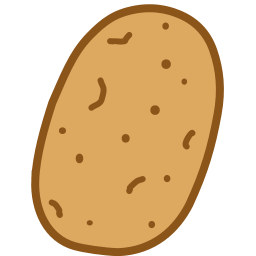

| Español | [English](docs/README_en.md) |
| :--: | :--: |

#  Motor Patata


<p style=""><b>Motor Patata</b> es un motor 2d sencillo y ligero con el enfoque en el desarrollo de videojuegos.</p>

<p>Soy novato en <b>C++</b>, estoy haciendo este proyecto para aprender y pasarmelo bien desarrollandolo, Asi que no esperes ver un codigo de profesional.</p>

<p>Otro de los objetivos es la <b>portabilidad</b>, quiero que este se pueda ejecutar en dispositivos antiguos (No tan antiguos), en los modernos y en varios sistemas operativos.</p>

⚠️ Aun no esta listo para su uso

## Ejemplo de su uso
[Programa de Ejemplo](examples/Simple Program/Main.cpp)

```cpp
#include <SDL.h>
#include <PatataEngine/PatataEngine.hpp>

int main(int argc, char ** argv) {
    Patata::Engine Patata;

    if (SDL_Init(SDL_INIT_EVERYTHING) != 0) exit(1);

    SDL_GL_SetAttribute(SDL_GL_DOUBLEBUFFER, 1);
    SDL_GL_SetAttribute(SDL_GL_CONTEXT_MAJOR_VERSION, 3);
    SDL_GL_SetAttribute(SDL_GL_CONTEXT_MINOR_VERSION, 1);
    SDL_GL_SetAttribute(SDL_GL_CONTEXT_PROFILE_MASK, SDL_GL_CONTEXT_PROFILE_CORE);

    SDL_Window * window = SDL_CreateWindow(
		#if defined(DEBUG)
		"Patata Engine | Debug (Development)",
		#else
		"Patata Engine",
		#endif
        SDL_WINDOWPOS_CENTERED,
        SDL_WINDOWPOS_CENTERED,
        1280, 720,
        Patata.GetWindowFlags());

	SDL_GLContext * context = nullptr;
 
	Patata.Info->pWindow = window;
	Patata.Info->pOpenGLContext = context;

	Patata.InitRenderer();

	bool run = true;
	while(run) {
		SDL_Event event;
		while(SDL_PollEvent(&event)) {
			// Patata Events
			Patata.HandleEvent(event);
			// Your Events
			if (event.type == SDL_QUIT) {
				run = false;
				break;
			}
		}
		
		// Your Render Functions

		Patata.Render();
	}
	
	if(*Patata.pGraphicsAPI == Patata::GraphicsAPI::OpenGL) {
		SDL_GL_DeleteContext(context);
		delete context;
		context = nullptr;
	}

	SDL_DestroyWindow(window);

	return 0;
}
```

## Sistemas Operativos Compatibles

| Windows | GNU/Linux |
| :-----: | :-----: |
|<b>x86_64</b> | <b>x86_64</b> |

## Metas

- [ ] Portabilidad en la distribucion de los binarios *(Linux distros)*
- [ ] Hacer el motor portable
- [ ] Menu Propio de ejemplo
- [X] Gestion de la configuracion
- [ ] Configuracion en caliente
- [ ] Salida del Audio
- [ ] Renderizador con Vulkan
- [ ] Renderizador con OpenGL
- [ ] Crear una Mascota
- [ ] Decodificar, Cargar y Renderizar imagenes ([AVIF](https://aomediacodec.github.io/av1-avif/))
- [ ] Reproducir secuencialmente animaciones de sprites
- [ ] Soporte Apropiado de Wayland (Linux)
- [X] Crear un logo o simbolo

## Para Hacer
- VkLayer_khronos_validation debe ser encontrado por Patata si este se compila con ```USE_EXTERNAL_LIBS```, y este debe de estar en su mismo directorio.
- ReHacer la forma en la que patata puede cargar o aceptar iconos para la ventana

## Dependencias usadas en este proyecto
<ul>
	<li><a href = "http://www.libsdl.org/">SDL2</a></li>
	<li><a href = "https://www.vulkan.org/">Vulkan</a></li>
	<ul>
		(<a href = "https://github.com/KhronosGroup/Vulkan-Headers.git">Vulkan-Headers</a>)
		(<a href = "https://github.com/KhronosGroup/Vulkan-ValidationLayers.git">Vulkan-ValidationLayers</a>)
		(<a href = "https://github.com/KhronosGroup/Vulkan-Loader.git">Vulkan-Loader</a>)
	</ul>
	<li><a href = "https://github.com/cppfastio/fast_io.git">fast_io</a></li>
	<li><a href = "https://github.com/Dav1dde/glad.git">Glad 2</a></li>
	<li><a href = "https://github.com/jbeder/yaml-cpp.git">yaml-cpp</a></li>
    <li><a href = "https://github.com/ocornut/imgui.git">Imgui</a></li>
</ul>

<hr>

### [Acceso a la documentacion](docs/README.md)

<hr>

## Espejos Oficiales
- [Github](https://github.com/Sendan4/Patata-Engine.git)
- [Codeberg](https://codeberg.org/Sendan/patata-engine.git)
