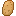

#  Patata Engine

<b>Patata Engine</b> es un motor 2d sencillo con el enfoque en el desarrollo de videojuegos, aclaro no es un videojuego es solo un motor en el que se puede contruir uno.

Soy novato en <b>C++</b>, estoy haciendo este proyecto para aprender y pasarmelo bien desarrollandolo, Asi que no esperes ver un codigo de profesional.

Otro de los objetivos es la <b>portabilidad</b>, quiero que este se pueda ejecutar en dispositivos antiguos (No tan antiguos) y en los modernos. En un futuro espero poder portear esto a <b>Android</b>, tambien pienso llevarlo a <b>iOS</b> y <b>Mac Os</b>, pero no puedo permitirme eso por ahora, asi que si alguien quiere portearlo para los sistemas de Apple, es bienvenido.

## Plataformas / Sistemas Operativos disponibles

<b>[Windows]() | [Linux]()</b>

## Estado General del proyecto
Aun no decido que licencia deberia tener este proyecto.

- Por ahora estoy enfocado en hacer funcionar Vulkan, y esto es lo que vez, aun no puedo renderizar nada.

### Las librerias usadas en este proyecto
<ul>
	<li>SDL2</li>
	<li>SDL2 Image</li>
	<li>SDL2 TTF</li>
	<li>Vulkan <i>(Vulkan.hpp)</i></li>
	<li>Glad 2 <i>(Multi-Loader used for OpenGL)</i></li>
	<li>libconfig</li>
</ul>

## [Acceso a la documentacion](https://gitlab.com/448L/patata-engine/-/wikis/Indice-%F0%9F%A5%94)
