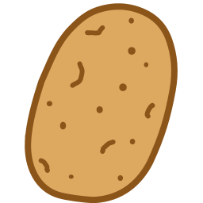

| [Español](README.md) | [English](doc/README_en.md) |
| :--: | :--: |

#  Motor Patata

<b>Motor Patata</b> es un motor 2d sencillo y ligero con el enfoque en el desarrollo de videojuegos.

Soy novato en <b>C++</b>, estoy haciendo este proyecto para aprender y pasarmelo bien desarrollandolo, Asi que no esperes ver un codigo de profesional.

Otro de los objetivos es la <b>portabilidad</b>, quiero que este se pueda ejecutar en dispositivos antiguos (No tan antiguos), en los modernos y en varios sistemas operativos.

# Sistemas Operativos disponibles

| Windows | GNU/Linux | HaikuOS |
| :-----: | :-----: | :-----: |
|<b>[x86_64]()</b> | <b>[x86_64]()</b> | |

# Metas

- [ ] Portabilidad en la distribucion de los binarios *(Linux distros)*
- [ ] Hacer el motor portable
- [ ] Menu Propio de ejemplo
- [ ] Gestion de la Configuracion
- [ ] Salida del Audio
- [ ] Renderizador con Vulkan
- [ ] Renderizador con OpenGL
- [ ] Crear una Mascota
- [ ] HaikuOS Port
- [ ] Decodificar, Cargar y Renderizar imagenes ([AVIF](https://aomediacodec.github.io/av1-avif/))
- [ ] Reproducir secuencialmente animaciones de sprites
- [ ] Soporte Apropiado de Wayland (Linux)
- [X] Crear un logo o simbolo

## Librerias de terceros usadas en este proyecto
<ul>
	<li><a href = "http://www.libsdl.org/">SDL2</a></li>
	<li><a href = "https://github.com/libsdl-org/SDL_image">SDL2 Image</a></li>
	<li><a href = "https://github.com/libsdl-org/SDL_ttf.git">SDL2 TTF</a></li>
	<li><a href = "https://www.vulkan.org/">Vulkan</a> <i>(<a href = "https://github.com/KhronosGroup/Vulkan-Hpp.git">Vulkan.hpp</a>)</i></li>
	<li><a href = "https://github.com/Dav1dde/glad.git">Glad 2</a> <i>(Multi-Cargador Usado para OpenGL)</i></li>
	<li><a href = "https://github.com/hyperrealm/libconfig">libconfig</a></li>
</ul>

# Licencia
Motor Patata esta bajo la licencia [MIT](LICENSE)

## [Acceso a la documentacion](doc/README.md)
